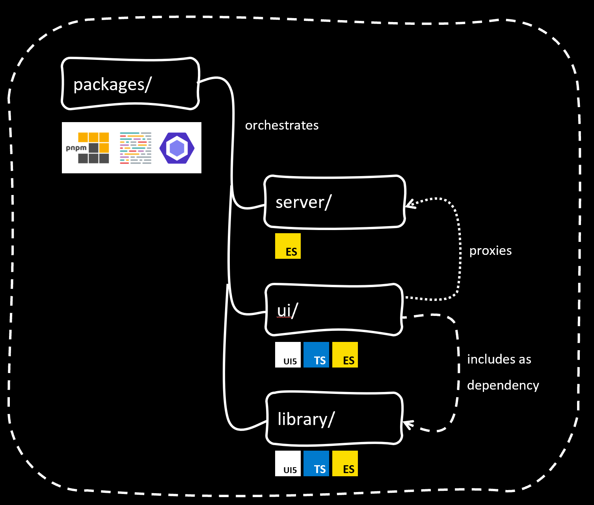
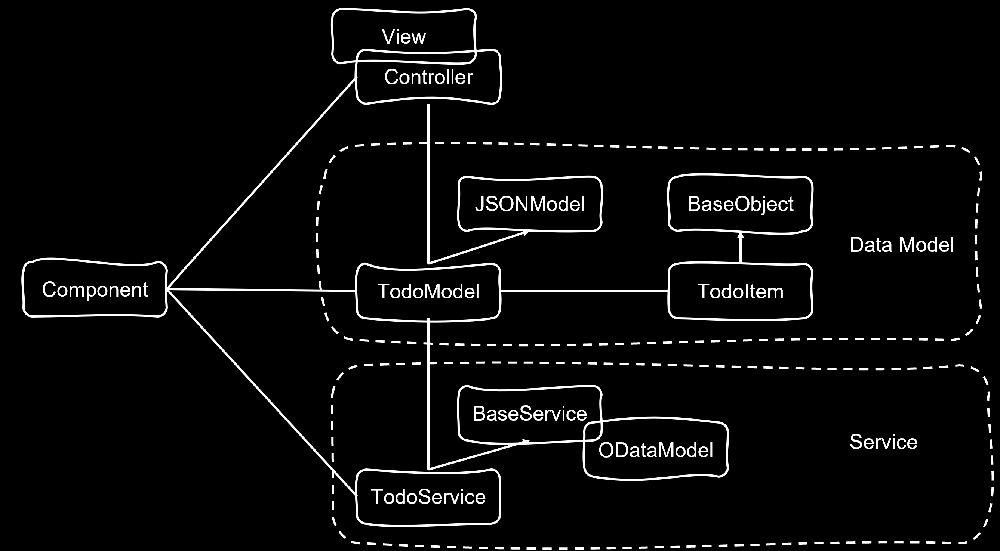

# Sample ToDo app UI5con 2022

## Description

This app demonstrates a TypeScript setup for developing UI5 applications containing a custom UI5 Library with a custom control and a CAP project as a backend.

**The ui package is inspired by the [`SAP-samples/ui5-typescript-helloworld`](https://github.com/SAP-samples/ui5-typescript-helloworld) project which  also contains [a detailed step-by-step guide](https://github.com/SAP-samples/ui5-typescript-helloworld/blob/main/step-by-step.md). It explains how this setup is created and how all the bits and pieces fit together**

| :point_up: Overview of TypeScript-related Entities |
|:---------------------------|
| The UI5 type definitions (`*.d.ts` files) are loaded as dev dependency from [npm](https://www.npmjs.com/package/@openui5/ts-types-esm). They are work in progress, so while they should be working well already, we are still improving them, which might also lead to breaking changes. |
| The file [tsconfig.json](tsconfig.json) contains the configuration for the TypeScript compilation, including a reference to these UI5 `*.d.ts` files. |
| Normally, the UI5 JavaScript files (controllers, Component.js etc.) would reside in the `webapp` folder. Now they are in the [src](src) folder. The TypeScript compilation will create the `webapp` folder and put all output there. |
| In addition to the TypeScript compilation, there is also a conversion from the ES6 module and class syntax used in the source files to the classic UI5 module loading and class definition syntax (`sap.ui.define(...)` and `superClass.extend(...)`). This conversion is using the [babel-plugin-transform-modules-ui5](https://github.com/r-murphy/babel-plugin-transform-modules-ui5) project from Ryan Murphy. |
| Both, the TypeScript compilation and the ES6 syntax transformation, are executed by Babel, as configured in the file [.babelrc.json](.babelrc.json) |
| This combined transformation is triggered by both the `build:ts` and `watch:ts` scripts in [package.json](package.json). |

## Project setup
PNPM as package manager for monorepo

Separate packages for:
 - UI5 application: packages/ui/
 - UI5 library: packages/library/
 - CAP server: packages/server/

CAP server is proxied by UI5 application

UI5 application depends on the UI5 library project which is consumed as regular dependency



## UI setup
This UI app demonstrates on how to get the most out of TypeScript using classes, generic types and much more. This is all explained in details in the following blog post: https://blogs.sap.com/2021/12/07/my-first-experience-with-typescript-in-ui5-classes-and-state-model-manager/

The app is separated in multiple layers:
 - Service layer which handles the communication to the backend
 - Data model layer which contains a virtual replication of the data model in the backend and handles everything related to the internal data model
 - View/controller will be dedicated to handle user interaction



## UI Library
More information regarding custom UI5 Libraries and custom controls can be found here: https://github.com/SAP-samples/ui5-typescript-control-library

## Testing
The end-to-end tests are done by using WDI5: https://github.com/ui5-community/wdi5

## Requirements

[npm](https://www.npmjs.com/) for dependency management.

## Preparation

Use `npm` to install the dependencies:

```sh
npm i
```

## Run the App

Execute the following command to run the app locally for development in watch mode (the browser reloads the app automatically when there are changes in the source code):

```sh
npm start
```

As shown in the terminal after executing this command, the app is then running on http://localhost:8080/index.html. A browser window with this URL should automatically open.

## Debug the App

In the browser, you can directly debug the original TypeScript code, which is supplied via sourcemaps (need to be enabled in the browser's developer console if it does not work straight away). If the browser doesn't automatically jump to the TypeScript code when setting breakpoints, use e.g. Ctrl+P in Chrome to open the `*.ts` file you want to debug.

## Build the App

Execute the following command to build all packages at once:

```sh
npm run build
```

## References

Once you have understood the setup and want to inspect the code of a slightly more comprehensive UI5 app written in TypeScript, you can check out the [TypeScript version of the UI5 CAP Event App Sample](https://github.com/SAP-samples/ui5-cap-event-app/tree/typescript).


## License

This project is licensed under the Apache Software License, version 2.0 except as noted otherwise in the [LICENSE](LICENSE) file.
